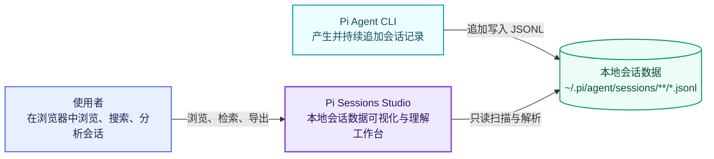
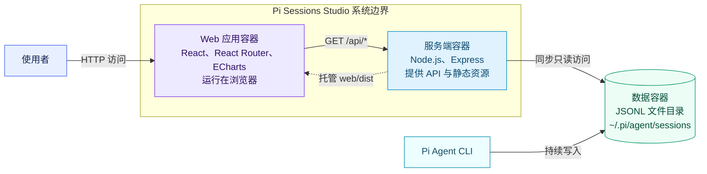
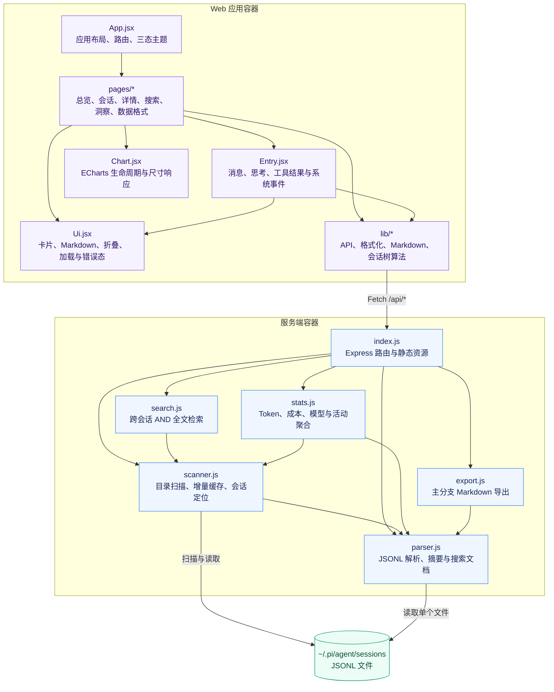
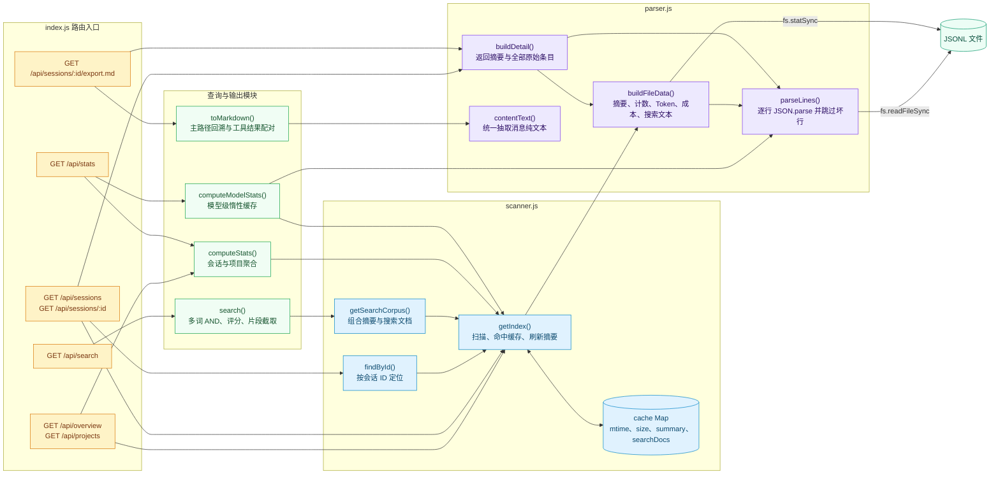

# Pi Sessions Studio：C4 四层架构导览

这份文档用 C4 的四个层级逐步放大项目：先看系统与外界的关系，再进入运行容器、前后端组件，最后落到核心后端函数。

## 先看结论

- 这是一个**只读本地工作台**：Pi Agent CLI 写入 JSONL，Pi Sessions Studio 只负责扫描、解析、检索和展示。
- 生产模式只有一个端口：Express 同时提供 `/api/*` 和 `web/dist` 静态资源。
- 没有数据库：原始事实来源始终是 `~/.pi/agent/sessions/**/*.jsonl`。
- 后端使用进程内增量缓存：文件的 `mtime` 或大小变化时才重新解析摘要和搜索文本。
- 会话详情保留树形分支；列表、搜索、统计和 Markdown 导出是这棵数据树的不同投影。

---

## C4 Level 1：System Context

这一层只回答三个问题：谁使用系统、系统解决什么问题、数据从哪里来。

[↗ 在 Mermaid.ai 打开](http://127.0.0.1:38473/v1/open/eyJ2IjoxLCJwYXRoIjoiL1VzZXJzL2FsZmhlaW0vY29kZS9kZW1vL3BpLXNlc3Npb25zLXN0dWRpby9DNC1BUkNISVRFQ1RVUkUubWQiLCJibG9ja19pZCI6ImIwMDc4ZWU3ZGUyZTQ0NTI4MzcwNTk5N2RhZmY4NDY1In0.CDR2BpCmtFvh8bI1gnCFM_tfpis43SEHdBCIY284dwA)


### 核心边界

- Pi Sessions Studio 不负责生成会话，也不会修改原始 JSONL。
- Pi Agent CLI 可以继续写文件；刷新页面时，后端会根据文件变化更新缓存。
- 当前服务没有鉴权，适合本机使用，不应直接暴露到不可信网络。

---

## C4 Level 2：Container

这一层展示运行时边界：浏览器、Node.js 服务和本地文件系统如何协作。

[↗ 在 Mermaid.ai 打开](http://127.0.0.1:38473/v1/open/eyJ2IjoxLCJwYXRoIjoiL1VzZXJzL2FsZmhlaW0vY29kZS9kZW1vL3BpLXNlc3Npb25zLXN0dWRpby9DNC1BUkNISVRFQ1RVUkUubWQiLCJibG9ja19pZCI6ImM4NWZmMjQwMjU2YzQwNjVhNjMxMTVhM2VkODk2YjhiIn0.JZghcSJuaFevnAcjxkq3RH6gIEhVPT76iG3fAVk760M)


### 运行方式

| 场景 | 浏览器入口 | 运行关系 |
| --- | --- | --- |
| 生产模式 | `http://localhost:5177` | Express 提供 API，并托管 Vite 构建产物 |
| 开发模式 | `http://localhost:5173` | Vite 热更新，`/api` 代理到 Express `5177` |

---

## C4 Level 3：Component

这一层进入两个容器内部，展示前端页面、共享组件和后端数据组件的职责。

[↗ 在 Mermaid.ai 打开](http://127.0.0.1:38473/v1/open/eyJ2IjoxLCJwYXRoIjoiL1VzZXJzL2FsZmhlaW0vY29kZS9kZW1vL3BpLXNlc3Npb25zLXN0dWRpby9DNC1BUkNISVRFQ1RVUkUubWQiLCJibG9ja19pZCI6IjA2YmE4NjdlNmY3YjQ1OTk5OTE3M2FkYWFkNzkxYTFlIn0.uBuj_JW3PixhyXIQwCNmUAagnNkMi2JEW6pXiLsVF10)


### 组件职责速查

| 目录或文件 | 主要职责 |
| --- | --- |
| `web/src/pages/` | 把 API 数据组织成六个用户页面 |
| `web/src/components/Entry.jsx` | 将 JSONL 条目映射为可读的时间线，并配对工具调用与结果 |
| `web/src/lib/tree.js` | 从 `id / parentId` 重建分支树和当前路径 |
| `server/src/scanner.js` | 建立会话索引，并按文件变化增量刷新 |
| `server/src/parser.js` | 一次遍历提取摘要、统计基础数据和搜索文本 |
| `server/src/search.js` | 对缓存搜索文档执行大小写不敏感的多词 AND 查询 |
| `server/src/stats.js` | 聚合日报、热力图、项目和模型使用数据 |
| `server/src/export.js` | 沿主路径生成可下载的 Markdown |

---

## C4 Level 4：Code

代码层聚焦后端核心，因为它决定了所有页面看到的数据。图中展示路由处理函数如何复用扫描、解析、检索、统计和导出函数。

[↗ 在 Mermaid.ai 打开](http://127.0.0.1:38473/v1/open/eyJ2IjoxLCJwYXRoIjoiL1VzZXJzL2FsZmhlaW0vY29kZS9kZW1vL3BpLXNlc3Npb25zLXN0dWRpby9DNC1BUkNISVRFQ1RVUkUubWQiLCJibG9ja19pZCI6IjRjNTYzMzZhZDk3YzQxYTY4NjY5MWJhMWQ0ZDI1NzI3In0.Iyf7ZpzWaQPXKBiPEwVce5yXLJ1hnNCQQzkMUFjOTzk)


### 四条关键执行链路

1. **总览和会话列表**：路由 → `getIndex()` → 增量缓存 → 会话摘要。
2. **会话详情**：`findById()` 定位文件 → `buildDetail()` 读取全部条目 → 前端 `tree.js` 重建分支。
3. **全局搜索**：`search()` → `getSearchCorpus()` → 对缓存的 `searchDocs` 进行多词匹配和排序。
4. **统计洞察**：`computeStats()` 聚合摘要；`computeModelStats()` 在需要时轻扫 assistant usage。

---

## 建议阅读顺序

想在十分钟内掌握代码，可按下面顺序阅读：

1. `README.md`：功能与启动方式。
2. `server/src/index.js`：先建立 API 全貌。
3. `server/src/scanner.js` → `server/src/parser.js`：理解数据如何进入系统。
4. `web/src/App.jsx` → `web/src/pages/SessionDetail.jsx`：理解 UI 路由和最复杂页面。
5. `web/src/lib/tree.js` → `web/src/components/Entry.jsx`：理解会话分支和消息渲染。
6. `server/src/search.js`、`server/src/stats.js`、`server/src/export.js`：理解三个派生能力。

## 本地运行

```bash
cd /Users/alfheim/code/demo/pi-packages/packages/pi-sessions-studio
npm install
npm run build
npm start
```

然后访问 `http://127.0.0.1:5177`。
